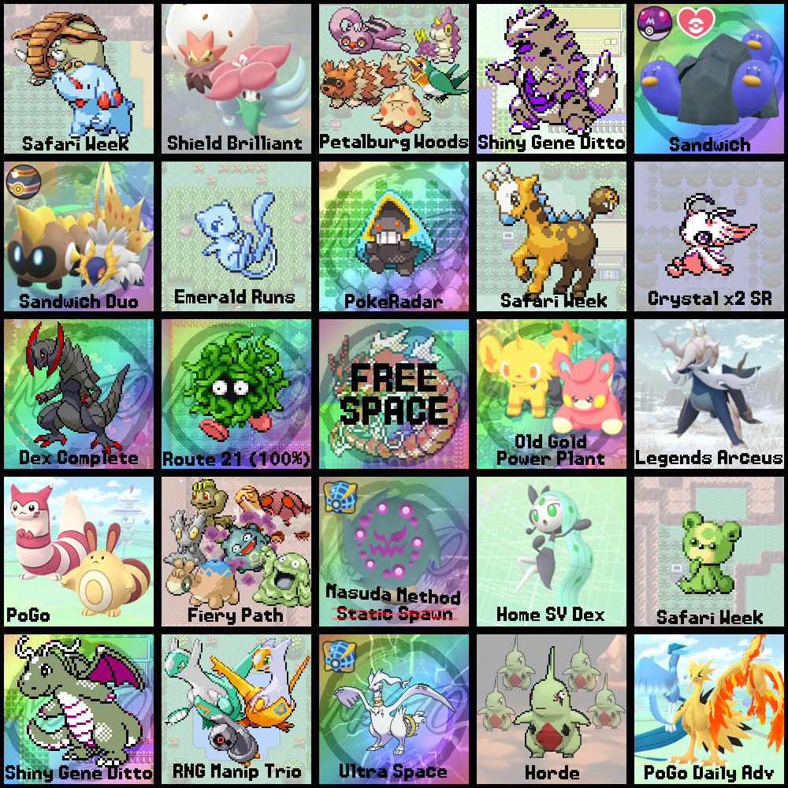
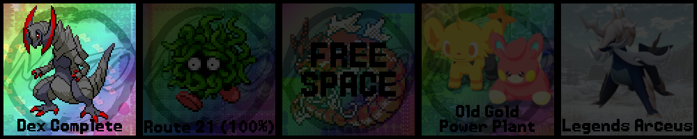
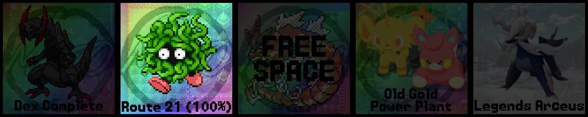

> *Image description: At the start of 2025, I designed this Bingo Card for my shiny hunts this year. Here is how it looked at the beginning of the year.*

# Jumping on the Bandwagon

Lorem ipsum dolor sit amet, consectetur adipiscing elit. Curabitur luctus feugiat sapien, sed tempus ipsum malesuada at. Etiam dictum diam purus, sit amet sagittis diam maximus ut. Phasellus odio nisi, luctus non malesuada a, vehicula vitae lectus. Integer euismod auctor sapien. Maecenas neque lectus, lacinia ac tempor ut, vulputate sit amet quam. Sed a orci imperdiet odio efficitur efficitur. Aenean ante ante, malesuada eget eleifend non, luctus quis risus. Etiam porta tincidunt dui, ac ultrices ipsum porttitor ac. Maecenas imperdiet risus dolor, quis consequat nunc mattis eget. Aliquam id rutrum eros.

# About 12 Months Later…

Line above image.

Now, let me reveal the final results of my bingo card for 2025.

# Breakdown

## ✗ Phanpy - Safari Week

Line below image.

## ? Gossifleur - Random Encounters

Line below image.

## ? Petalburg Woods - Random Encounters

Line below image.

## Tyranitar - Gen 2 Eggs

Line below image.

## ✓ Wugtrio - Destiny Mark

Line below image.

## ✓ Falinks & Slither Wing - 2-for-1 Sandwhich

Line below image.

## Mew - Faraway Island

Line below image.

## ✓ Snorunt - PokéRadar

Line below image.

## ✗ Girafarig - Safari Week

Line below image.

## Celebi - Ilex Forest, Crystal

Line below image.

## ✓ Haxorus - B2W2 Nature Preserve

Line below image.

## ✓ Tangela - 100% Repel Trick

Line below image.

## ✓ Old Gold Power Plant - Pokémon Sleep

Line below image.

## ✗ Hisuian Samurott - Massive Mass Outbreaks

Line below image.

## Sentret - Pokémon Go

Line below image.

## Fiery Path - Random Encounters

Line below image.

## ✓* Spiritomb - It's Complicated…

:::note
The full story of this hunt is 95% planning gone awry. To prevent this post from being even longer than it already is, this section will focus mainly on the actual hunt as it happened. If you're interested in the myriad of missteps that led up to this hunt, click through to read the full story [here](/posts/the-world-of-pokemon/108-malevolent-spirits/).
:::
Line below image.

## Meloetta - Home Dex Reward

Line below image.

## Teddiursa - Safari Week

Line below image.

## ✓ Dragonite - Gen 2 Eggs

Line below image.

## Eon Duo & Beldum - Gen 3 RNG Trio

Line below image.

## Reshiram - Ultra Wormholes

Line below image.

## Larvitar - XY Hordes

Line below image.

## Galarian Bird - Pokémon Go

Line below image.

# Final Thoughts

Blah blah, conclusion.
